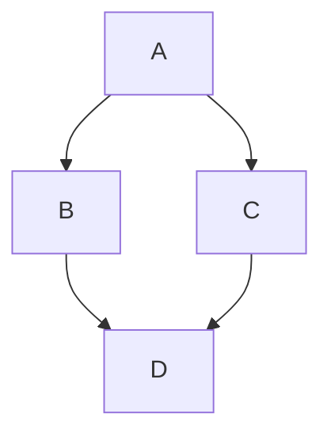

# 10 | Technische Kern
In dit onderdeel staat het generieke, technische en herbruikbare deel beschreven voor databeschikbaarheid. De implementatiewijzers van de zorgtoepassingen van Twiin zijn gebaseerd op deze generieke kern.

> [!NOTE]
> Het metamodel beschrijft de componenten waaruit de technische kern is opgebouwd en welke onderlinge relaties er kunnen zijn. Het metamodel van de technische kern bevat geen afspraken, maar is toegevoegd voor een juiste interpretatie van de technische kern.

## Componenten van de technische kern
| Component | Korte omschrijving |
| --- | --- |
| Communicatiepatroon | Een communicatiepatroon beschrijft hoe gegevens worden uitgewisseld tussen zorgpartijen vanuit organisatorisch-juridisch (technologie-agnostisch) en technisch oogpunt. De functionele use case (een toepassing) zal bepalen welk of welke communicatiepatronen gebruikt moeten worden. |
| Generieke functie | Een generieke functie is een basisfunctionaliteit die zorgbreed nodig is voor elektronische gegevensuitwisseling en/of in meerdere toepassingen gebruikt wordt. |
| TA | Een Technical Agreement (TA) beschrijft de technische afspraken die gemaakt moeten worden om een bepaalde uitwisseling te kunnen implementeren. Een functionele use case die waarin een bepaald communicatiepatroon gebruikt zal hiervoor meerdere TA’s voor moeten volgen om de gehele uitwisseling te implementeren, waaronder de TA’s van de benodigde generieke functies.  > [!NOTE] > Een functionele use case waarin de cliënt vanuit zorgaanbieder A verwezen wordt naar zorgaanbieder B en dat daarvoor een dossier bij de laatste moet belanden kan geïmplementeerd worden met het communicatiepatroon ‘gericht beschikbaar stellen’ (maar ook met het communicatiepatroon ‘verzenden’). Om een implementatie te doen van het het uitwisselingen van het dossier tussen zorgaanbieder A en B via het communicatiepatroon gericht beschikbaar stellen zullen meerdere TA’s geïmplementeerd worden, zoals bijvoorbeeld de TA voor authenticatie, de TA voor het verzenden en ontvangen van een notificatie, de TA voor het raadplegen van het dossier en de TA voor het implementeren van een veilig netwerk.  Het kan zijn dat er meerdere varianten van een TA worden ontwikkeld. Bijvoorbeeld: een authenticatie kan gedaan worden op basis van SAML2, maar ook met OpenID Connect. Berichtuitwisseling kan Service Oriented (SOAP) of Resource Oriented (RESTfull) plaatsvinden. Deze keuzes leiden tot een verschillende implementatie van technologie. In het Twiin Afsprakenstelsel worden deze keuzes vastgelegd. |
| TTA | Twiin Technical Agreement (TTA): Het komt voor dat er TA’s zijn ontwikkeld maar dat deze nog niet (geheel) aansluiten bij het vertrouwensmodel van Twiin. TTA’s zijn technische afspraken die aanvullende afspraken bevat die in lijn liggen met het Twiin Vertrouwensmodel. Ook kan het zijn dat er een TTA is waar er nog helemaal geen (landelijke) invulling is gegeven aan een bepaald aspect van een gegevensuitwisseling en heeft Twiin hier noodzakelijkerwijs zelf keuzes moeten maken.  Het is mogelijk dat een TA in verschillende technische alternatieven wordt uitgewerkt, zoals SOAP of FHIR. |
| Transactie | Transacties beschrijven de berichten benodigd voor de communicatie tussen Gevalideerde Twiin Knooppunten onderling of tussen Gevalideerde Twiin Knooppunten en gemeenschappelijke voorzieningen. Een TA kan meerdere transacties voorschrijven, maar een transactie zou niet in meerdere TA’s moeten voorkomen (maar er mag vanuit een TA natuurlijk wel verwezen worden naar andere TA’s en transacties. |
| Content | (Meta)data die nodig is om een transactie te implementeren. Denk bijvoorbeeld aan codelijsten of informatiestandaarden. |

- Volume 0a bevat een functioneel overzicht van de communicatiepatronen die gebruikt kunnen worden bij gegevensuitwisseling en, in Volume 0b, de generieke functies die daarbij (mogelijk) nodig zijn. Dit volume is voor een breed publiek (informatiemanagers, architecten) geschreven in het Nederlands. Er zijn vier typen communicatiepatronen die een technische invulling zijn van de twee manieren van gegevens uitwisselen: [verzenden en raadpleegbaar maken](). In de technische kern worden deze manieren van gegevens uitwisselen op een generieke manier beschreven. Een zorgtoepassing (in het Twiin Afsprakenstelsel) kiest welk communicatiepatroon het best geschikt is voor de betreffende use case(s). Afhankelijk van het type communicatiepatroon en de gekozen technische uitwerking (in volume 1) gelden andere voorwaarden voor validatie. Een communicatiepatroon beschrijft puur de vorm/volgorde van acties in een gegevensuitwisseling, maar dient ondersteund te worden door zogenaamde generieke functies, zoals identificatie en authenticatie (van zorgverleners, zorgaanbieders en hun informatiesystemen), autorisatie, logging en toestemming. 

- Volume 1a bevat de technische uitwerking in Twiin Technical Agreements (de Twiin Technische Afspraken) van de communicatiepatronen tussen de GtK's (Gevalideerde Twiin Knooppunten), Let op dat er voor voor één communicatiepatroon meerdere technische uitwerkingen kunnen bestaan, zoals [SOAP](https://en.wikipedia.org/wiki/SOAP) of [REST](https://en.wikipedia.org/wiki/REST).  Volume 1b bevat de technische afspraken voor de uitwerking van de generieke functies. Dit volume is bestemd voor ontwerpers en solution architecten voor een internationale doelgroep en daarom geschreven in het Engels. Een technische uitwerking van een communicatiepatroon of generieke functie kan (als dit al voldoende is uitgewerkt) een Programma van Eisen (PvE) bevatten. Deze PvE’s zijn (nog) in het Nederlands geschreven.

- Volume 2 bevat de gedetailleerde technische beschrijvingen van de berichten/transacties die in de communicatiepatronen (volume 2a) of generieke functies (volume 2b) worden gebruikt.

- Volume 3 bevat de content, zoals bijvoorbeeld metadata, die overkoepelend geldt voor de zorgtoepassingen.

### Eisen

De kern bevat eisen voor de generieke functies. Deze zijn niet per definitie van toepassing bij een zorgtoepassing. Per zorgtoepassing wordt bepaald aan welke eisen moet worden voldaan. Dit zullen generieke en zorgtoepassing specifieke eisen zijn.

 
> [!NOTE]
> ## Statement
> Twiin volgt de ontwikkelen op het vlak van [Generieke Functies](https://www.datavoorgezondheid.nl/generieke-functies) en NEN-normeringen als onderdeel van de Wegiz. Twiin sluit aan op de keuzes die op landelijk niveau worden gemaakt en neemt deze op in het Twiin Afsprakenstelsel. Daarnaast volgt Twiin EHDS en sluit hierbij aan.